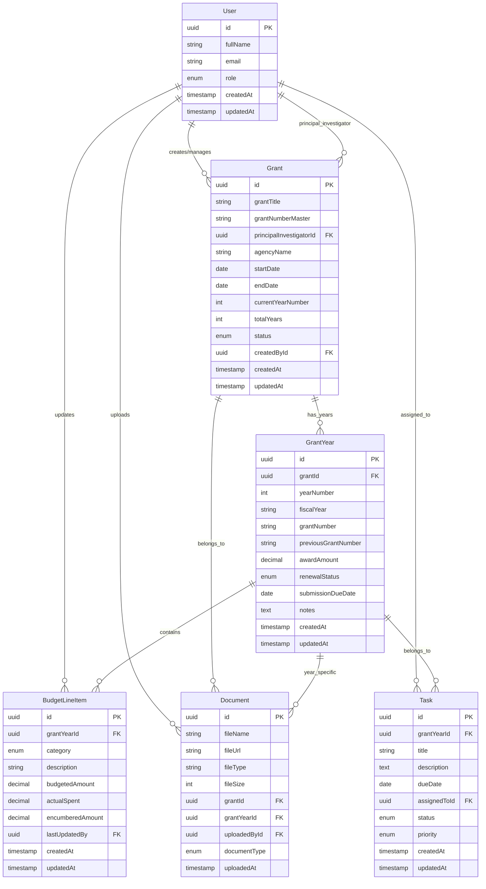
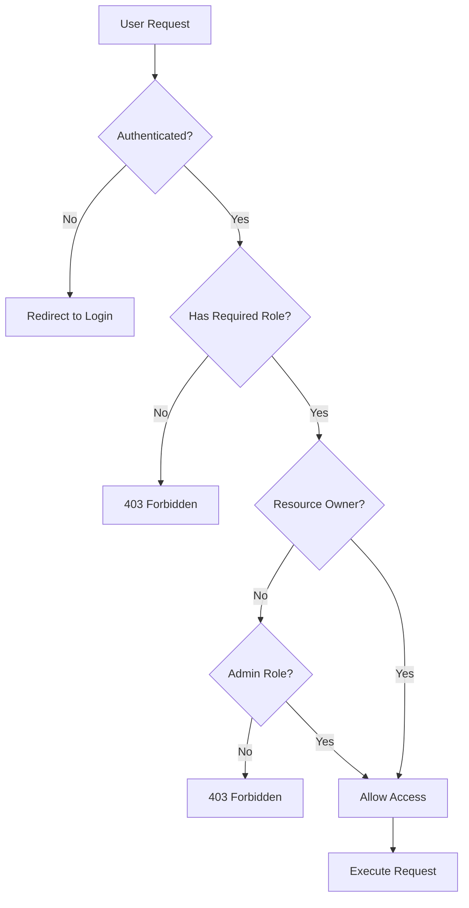
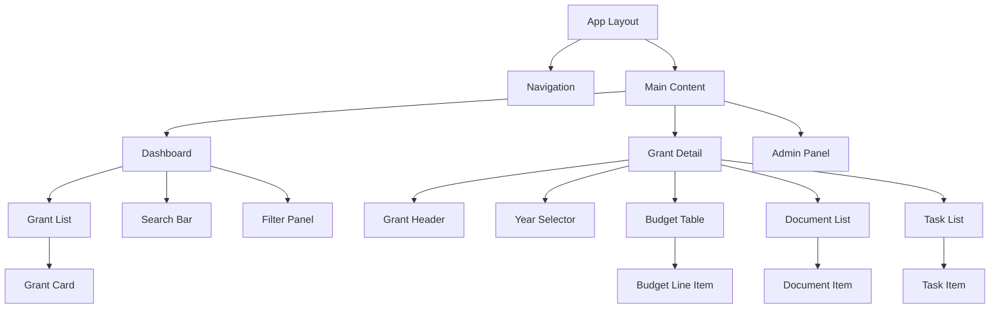

# Grant Tracker 2.0 - Architecture Plan

## 🏗️ System Architecture Overview

Grant Tracker 2.0 is a full-stack web application for managing multi-year federal grants with role-based access control, document management, and budget tracking capabilities.

### Tech Stack Decision Matrix

| Component          | Choice                          | Rationale                                                                        |
| ------------------ | ------------------------------- | -------------------------------------------------------------------------------- |
| **Frontend**       | Next.js 14 (App Router) + React | Modern SSR/SSG, excellent developer experience, built-in optimization            |
| **Styling**        | Tailwind CSS                    | Rapid development, consistent design system, small bundle size                   |
| **API Layer**      | tRPC                            | End-to-end type safety, excellent Next.js integration, auto-generated client     |
| **Database**       | PostgreSQL (Supabase)           | Relational data integrity, excellent JSON support, managed service               |
| **ORM**            | Prisma                          | Type-safe database access, excellent migration system, great Next.js integration |
| **Authentication** | Clerk                           | Built-in RBAC, easy Next.js integration, comprehensive user management           |
| **File Storage**   | UploadThing                     | Seamless Next.js integration, built for React applications                       |
| **Validation**     | Zod                             | Runtime type validation, tRPC integration, excellent TypeScript support          |
| **Development DB** | Docker PostgreSQL               | Consistent local development environment                                         |

## 🗄️ Database Schema Architecture



## 🔐 Authentication & Authorization Architecture

### Role-Based Access Control (RBAC)

| Role                            | Permissions                                                        |
| ------------------------------- | ------------------------------------------------------------------ |
| **Admin**                       | Full system access, user management, create/edit/delete all grants |
| **PI (Principal Investigator)** | View/edit assigned grants, upload documents, manage tasks          |
| **Finance**                     | View all grants, edit budgets, upload financial documents          |
| **Viewer**                      | Read-only access to assigned grants                                |

### Authorization Flow



## 🏛️ Application Architecture

### Folder Structure

```
grant-tracker-2.0/
├── src/
│   ├── app/                    # Next.js App Router
│   │   ├── (auth)/            # Auth group routes
│   │   ├── dashboard/         # Dashboard pages
│   │   ├── grant/             # Grant management pages
│   │   ├── admin/             # Admin pages
│   │   └── api/               # API routes
│   ├── components/            # Reusable UI components
│   │   ├── ui/               # Base UI components
│   │   ├── forms/            # Form components
│   │   └── layout/           # Layout components
│   ├── lib/                  # Utility libraries
│   │   ├── db.ts            # Database connection
│   │   ├── auth.ts          # Auth configuration
│   │   └── utils.ts         # Utility functions
│   ├── server/              # tRPC server code
│   │   ├── api/             # tRPC routers
│   │   └── db/              # Database schemas
│   └── types/               # TypeScript type definitions
├── prisma/                  # Database schema and migrations
├── public/                  # Static assets
└── docs/                   # Documentation
```

### Component Architecture



## 🔄 Data Flow Architecture

### tRPC API Structure

```
api/
├── grant/
│   ├── create
│   ├── update
│   ├── delete
│   ├── getById
│   └── getAll
├── grantYear/
│   ├── create
│   ├── update
│   ├── getByGrantId
│   └── getCurrentYear
├── budget/
│   ├── createLineItem
│   ├── updateLineItem
│   ├── deleteLineItem
│   └── getByGrantYear
├── document/
│   ├── upload
│   ├── delete
│   ├── getByGrant
│   └── getByGrantYear
├── task/
│   ├── create
│   ├── update
│   ├── delete
│   └── getByGrantYear
└── user/
    ├── getProfile
    ├── updateProfile
    └── getAll (admin only)
```

## 📱 User Interface Architecture

### Design System

- **Color Palette**: Professional blue/gray theme with status colors
- **Typography**: Inter font family for readability
- **Components**: Shadcn/ui base components with custom extensions
- **Responsive**: Mobile-first design with desktop optimization

### Page Hierarchy

```
/ (Landing/Login)
├── /dashboard
│   ├── Grant overview cards
│   ├── Search and filters
│   └── Quick actions
├── /grant/[id]
│   ├── Grant overview
│   ├── Year selector
│   ├── Budget summary
│   └── Recent activity
├── /grant/[id]/year/[yearId]
│   ├── Year details
│   ├── Budget line items
│   ├── Documents
│   └── Tasks
└── /admin
    ├── User management
    ├── System settings
    └── Audit logs
```

## 🔧 Development Workflow

### Local Development Setup

1. **Environment**: Docker Compose for PostgreSQL
2. **Database**: Prisma migrations and seeding
3. **Authentication**: Clerk development keys
4. **File Storage**: UploadThing development configuration

### Code Quality Standards

- **TypeScript**: Strict mode enabled
- **ESLint**: Next.js recommended + custom rules
- **Prettier**: Consistent code formatting
- **Husky**: Pre-commit hooks for quality checks

### Testing Strategy

- **Unit Tests**: Jest + React Testing Library
- **Integration Tests**: Playwright for E2E
- **API Tests**: tRPC testing utilities
- **Database Tests**: Prisma test database

## 🚀 Deployment Architecture

### Production Stack

- **Frontend**: Vercel (automatic deployments from Git)
- **Database**: Supabase PostgreSQL (managed)
- **File Storage**: UploadThing (production tier)
- **Authentication**: Clerk (production environment)

### Environment Configuration

- **Development**: Local Docker + development services
- **Staging**: Vercel preview deployments
- **Production**: Vercel production + managed services

## 📊 Performance Considerations

### Database Optimization

- Proper indexing on frequently queried fields
- Connection pooling via Prisma
- Query optimization with select statements

### Frontend Optimization

- Next.js automatic code splitting
- Image optimization with next/image
- Static generation where possible
- Client-side caching with React Query

### Security Measures

- Input validation with Zod schemas
- SQL injection prevention via Prisma
- XSS protection with proper sanitization
- CSRF protection via Next.js built-ins
- File upload validation and scanning

## 🔍 Monitoring & Observability

### Logging Strategy

- Structured logging with Winston
- Error tracking with Sentry integration
- Performance monitoring with Vercel Analytics
- Database query monitoring via Prisma

### Health Checks

- API endpoint health checks
- Database connection monitoring
- File storage availability checks
- Authentication service status

This architecture provides a solid foundation for building a scalable, maintainable, and secure grant management system that can grow with your organization's needs.
