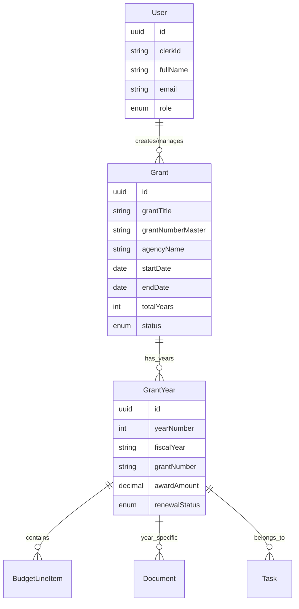

# Grant Tracker 2.0 🎯

A comprehensive multi-year federal grant management platform built for educational institutions and grant managers. Track grants across multiple years with budget management, document storage, and role-based access control.

## 🚀 Features

### Core Functionality

- **Multi-Year Grant Tracking**: Manage grants spanning up to 5 years with unique yearly grant numbers
- **Budget Management**: Track budgeted vs. actual spending across different categories
- **Document Management**: Upload and organize grant-related documents with type categorization
- **Task Management**: Create and assign tasks with due dates and priorities
- **Advanced Search**: Find grants by title, number, PI, or agency
- **Role-Based Access**: Admin, PI, Finance, and Viewer roles with appropriate permissions

> **📋 Portfolio Note**: This is a demonstration project showcasing full-stack development capabilities. See [PORTFOLIO_NOTES.md](./PORTFOLIO_NOTES.md) for details about mock data vs. real implementation. **Demo credentials**: `demo@university.edu` / `demo123`

### User Experience

- **Modern UI**: Clean, responsive design built with Tailwind CSS
- **Year Navigation**: Easy switching between grant years with dropdown/stepper interface
- **Dashboard Overview**: Quick access to all grants with status indicators
- **Real-time Updates**: Live data synchronization across all users
- **Consistent Color Scheme**: Standardized badge colors across all components for better UX
- **Enhanced Task Management**: Improved task statistics with color-coded status indicators

## 🛠️ Tech Stack

### Frontend

- **Framework**: Next.js 14 with App Router
- **Language**: TypeScript
- **Styling**: Tailwind CSS
- **UI Components**: Radix UI + Custom Components
- **State Management**: React Query + tRPC

### Backend

- **API**: tRPC for end-to-end type safety
- **Database**: PostgreSQL with Prisma ORM
- **Authentication**: Clerk
- **File Storage**: UploadThing
- **Validation**: Zod schemas

### Development & Deployment

- **Development**: Docker for local database
- **Hosting**: Vercel (frontend) + Supabase (database)
- **Testing**: Jest + React Testing Library + Playwright
- **Code Quality**: ESLint + Prettier + Husky

## 📊 Data Model



## 🚦 Getting Started

### Prerequisites

- Node.js 18+
- Docker Desktop
- Git

### Installation

1. **Clone the repository**

   ```bash
   git clone https://github.com/your-org/grant-tracker-2.0.git
   cd grant-tracker-2.0
   ```

2. **Install dependencies**

   ```bash
   npm install
   ```

3. **Set up environment variables**

   ```bash
   cp .env.example .env.local
   # Edit .env.local with your configuration
   ```

4. **Start the database**

   ```bash
   docker-compose up -d postgres
   ```

5. **Set up the database**

   ```bash
   npx prisma migrate dev
   npx prisma db seed
   ```

6. **Start the development server**
   ```bash
   npm run dev
   ```

Visit [http://localhost:3000](http://localhost:3000) to see the application.

### 🎭 Demo Mode

This application runs in demo mode with mock authentication:

- **Sign In**: Visit `/sign-in` with pre-filled credentials
- **Demo User**: `demo@university.edu` with ADMIN role
- **Full Access**: Explore all features without setup
- **Sign Out**: Test complete authentication flow

## 📁 Project Structure

```
grant-tracker-2.0/
├── src/
│   ├── app/                    # Next.js App Router pages
│   │   ├── (auth)/            # Authentication routes
│   │   ├── dashboard/         # Dashboard pages
│   │   ├── grant/             # Grant management pages
│   │   └── api/               # API routes
│   ├── components/            # React components
│   │   ├── ui/               # Base UI components
│   │   ├── forms/            # Form components
│   │   └── layout/           # Layout components
│   ├── lib/                  # Utility libraries
│   ├── server/               # tRPC server code
│   │   ├── api/              # tRPC routers
│   │   └── db/               # Database utilities
│   └── types/                # TypeScript definitions
├── prisma/                   # Database schema & migrations
├── public/                   # Static assets
└── docs/                     # Documentation
```

## 🔐 Authentication & Authorization

### User Roles

| Role        | Permissions                                                        |
| ----------- | ------------------------------------------------------------------ |
| **Admin**   | Full system access, user management, create/edit/delete all grants |
| **PI**      | View/edit assigned grants, upload documents, manage tasks          |
| **Finance** | View all grants, edit budgets, upload financial documents          |
| **Viewer**  | Read-only access to assigned grants                                |

### Security Features

- JWT-based authentication via Clerk
- Role-based access control (RBAC)
- Input validation with Zod schemas
- SQL injection prevention via Prisma
- File upload validation and type checking

## 📱 Key Pages

### Dashboard (`/dashboard`)

- Grant overview cards with status indicators
- Search and filter functionality
- Quick action buttons
- Recent activity feed

### Grant Detail (`/grant/[id]`)

- Grant header with title, agency, and status
- Year selector dropdown
- Budget summary
- Document list
- Task overview

### Grant Year Detail (`/grant/[id]/year/[yearId]`)

- Detailed year information
- Budget line items table
- Year-specific documents
- Tasks and deadlines

## 🧪 Testing

```bash
# Run unit tests
npm run test

# Run integration tests
npm run test:integration

# Run E2E tests
npm run test:e2e

# Run all tests with coverage
npm run test:coverage
```

## 🚀 Deployment

### Development

```bash
npm run dev
```

### Production Build

```bash
npm run build
npm start
```

### Deploy to Vercel

```bash
vercel --prod
```

## 📚 API Documentation

The application uses tRPC for type-safe API calls. Key endpoints include:

### Grant Management

- `grant.getAll` - List all grants with filtering
- `grant.getById` - Get detailed grant information
- `grant.create` - Create new grant (Admin only)
- `grant.update` - Update grant details

### Budget Management

- `budget.getByGrantYear` - Get budget line items
- `budget.createLineItem` - Add budget line item
- `budget.updateLineItem` - Update budget amounts

### Document Management

- `document.upload` - Upload new document
- `document.getByGrant` - List grant documents
- `document.delete` - Remove document

## 🤝 Contributing

1. Fork the repository
2. Create a feature branch (`git checkout -b feature/amazing-feature`)
3. Commit your changes (`git commit -m 'Add amazing feature'`)
4. Push to the branch (`git push origin feature/amazing-feature`)
5. Open a Pull Request

### Development Guidelines

- Follow TypeScript strict mode
- Use Prettier for code formatting
- Write tests for new features
- Update documentation as needed

## 📄 License

This project is licensed under the MIT License - see the [LICENSE](LICENSE) file for details.

## 🆘 Support

- **Documentation**: Check the `/docs` folder for detailed guides
- **Issues**: Report bugs via GitHub Issues
- **Discussions**: Use GitHub Discussions for questions

## 🗺️ Roadmap

### Phase 1 (MVP) ✅

- [x] Basic grant management
- [x] User authentication
- [x] Budget tracking
- [x] Document uploads

### Phase 2 (Enhanced Features)

- [ ] Advanced reporting
- [ ] Email notifications
- [ ] Audit trail
- [ ] Data export/import

### Phase 3 (Enterprise Features)

- [ ] Multi-tenant support
- [ ] Advanced analytics
- [ ] Integration APIs
- [ ] Mobile app

## 🙏 Acknowledgments

- Built with [Next.js](https://nextjs.org/)
- UI components from [Radix UI](https://www.radix-ui.com/)
- Database management with [Prisma](https://www.prisma.io/)
- Authentication by [Clerk](https://clerk.com/)
- Styled with [Tailwind CSS](https://tailwindcss.com/)

---

**Grant Tracker 2.0** - Simplifying federal grant management for educational institutions.
